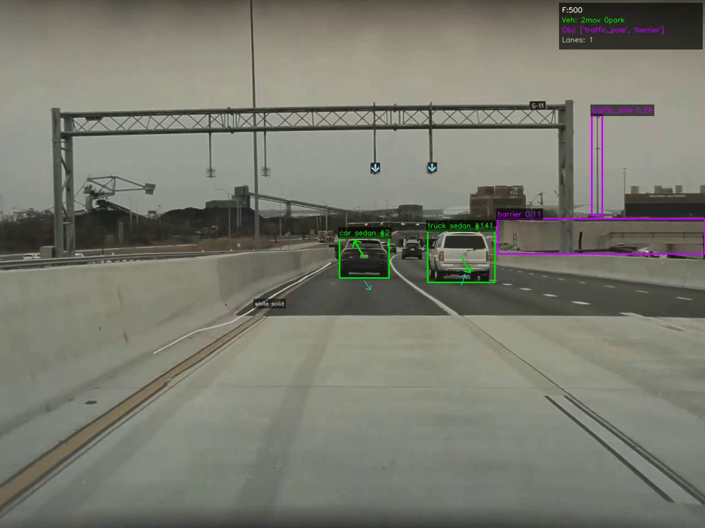
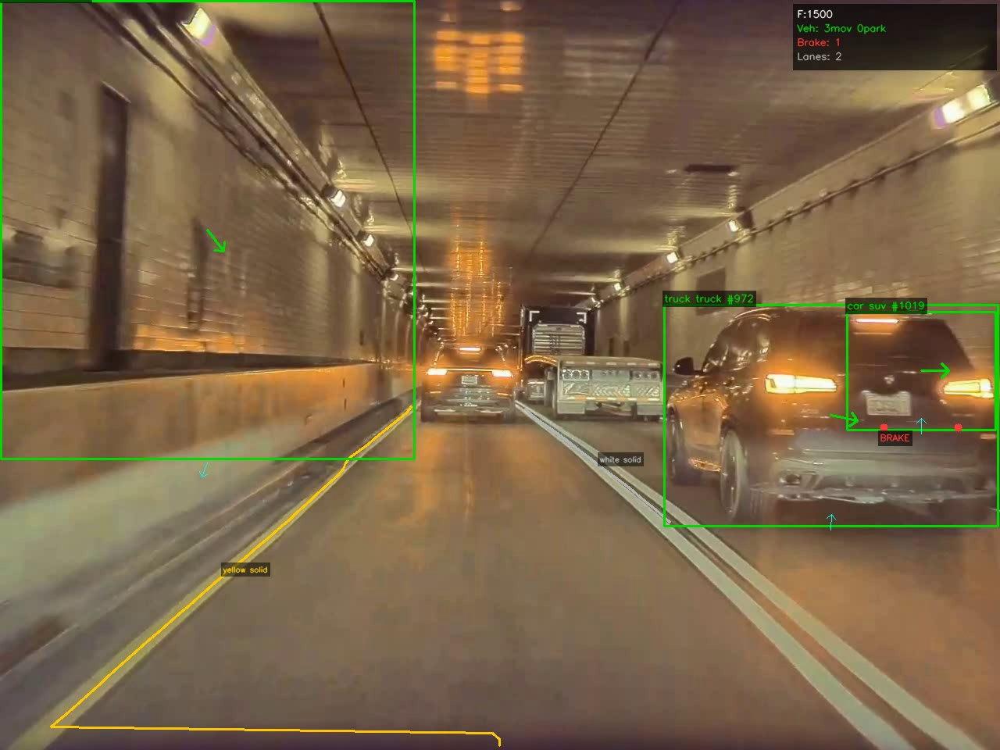
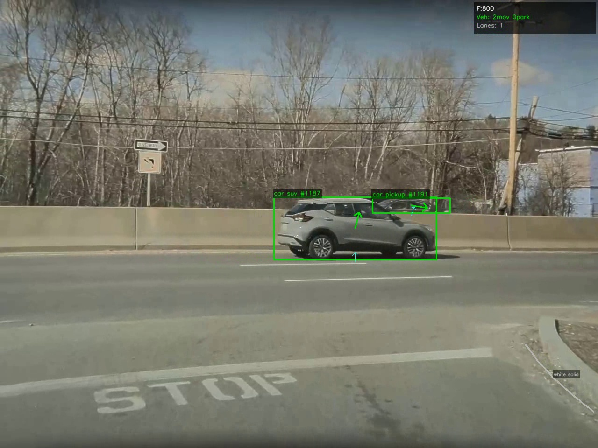
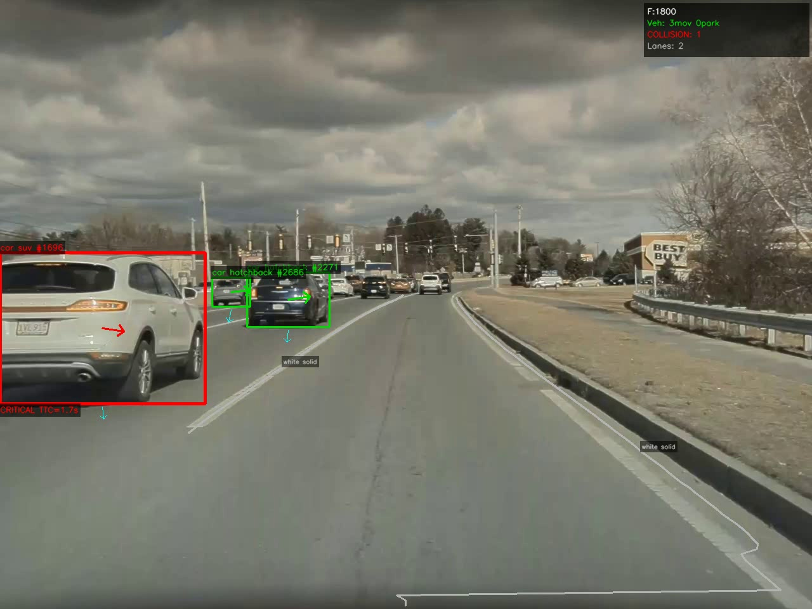
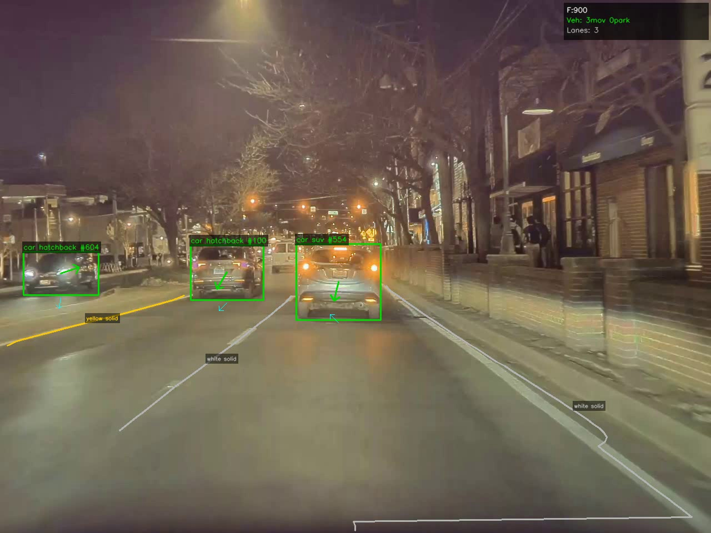
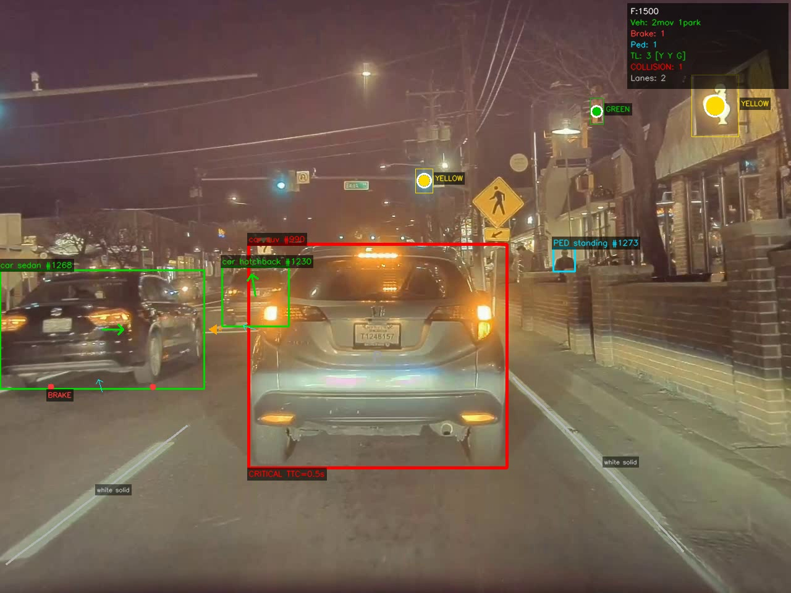
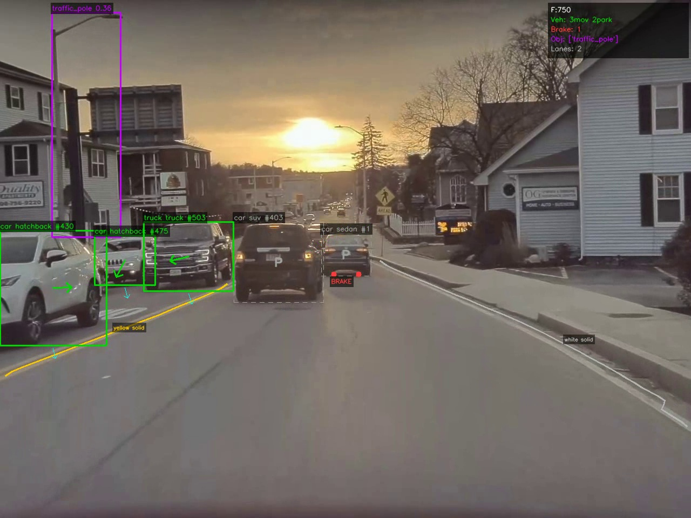
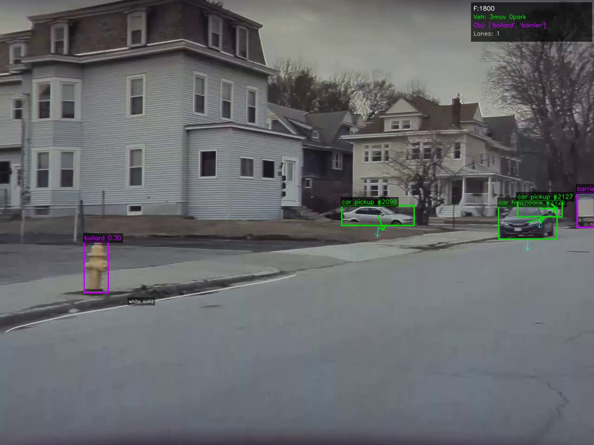
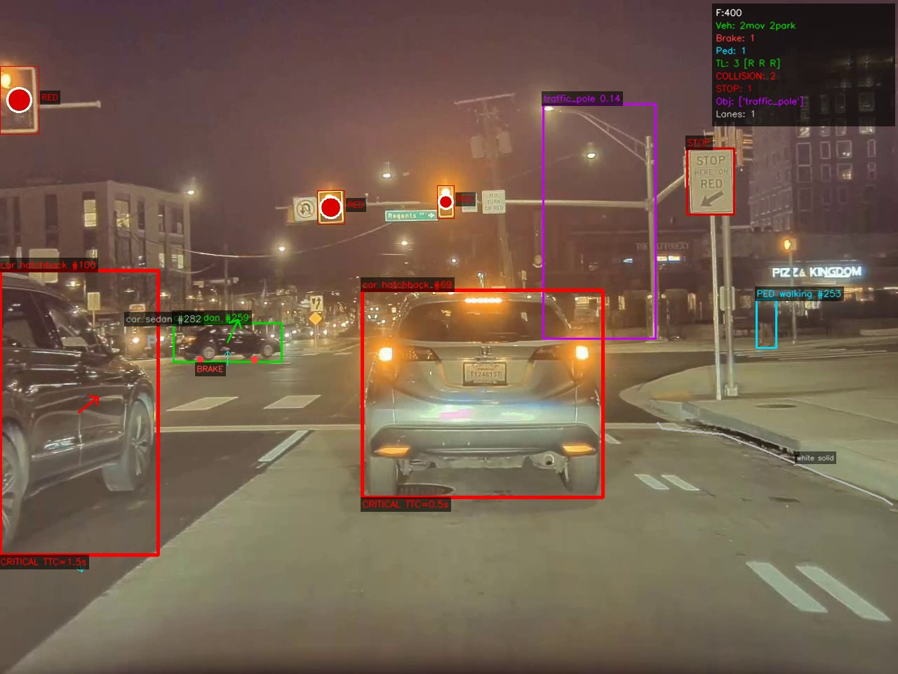
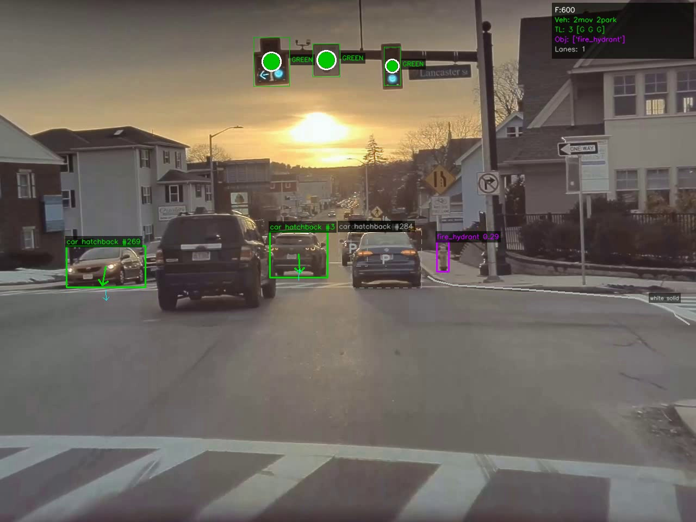

# MultiCam-AutonomousDriving-Perception — Tesla FSD-Style 4-Camera Pipeline

**RBE549 Computer Vision (Spring 2026) — Project 3**

A multi-camera autonomous-driving perception system that reproduces the look and feel of Tesla's Full Self-Driving visualization. The pipeline ingests synchronized dashcam video from a 2023 Tesla Model S (front, back, left, right), runs a stack of state-of-the-art deep networks for detection, segmentation, metric depth, tracking, pose, and monocular 3D, fuses every camera into a single ego-frame 3D scene, and renders a Tesla-style overlay that highlights vehicles, pedestrians, lanes, traffic lights, road signs, small obstacles, brake / turn-indicator events, speed bumps, and predicted collision risk.

---

## Authors

**Aryan Shah**
Robotics Engineering
Worcester Polytechnic Institute
Worcester, MA
Email: ajshah1@wpi.edu

**Anirudh Nallawar**
Robotics Engineering
Worcester Polytechnic Institute
Worcester, MA
Email: arnallawar@wpi.edu

---

## Table of Contents

1. [Detection Showcase](#1-detection-showcase)
2. [Quick Start](#2-quick-start)
3. [Environment Setup](#3-environment-setup)
4. [Data Layout](#4-data-layout)
5. [Running the Pipeline](#5-running-the-pipeline)
6. [Visualization](#6-visualization)
7. [Pipeline Architecture](#7-pipeline-architecture)
8. [Repository Structure](#8-repository-structure)
9. [File Reference](#9-file-reference)
10. [Configuration](#10-configuration)
11. [Output Format](#11-output-format)
12. [Troubleshooting](#12-troubleshooting)
13. [Failures and Known Limitations](#13-failures-and-known-limitations)
14. [Future Work and Improvements](#14-future-work-and-improvements)

---

## 1. Detection Showcase

Representative frames from sequences 02, 03, 10 and 11. Every frame below is produced by the exact same pipeline; only the scene and lighting change. The HUD panel in the top-right corner of each frame reports live counts per category.

### 1.1 Vehicle Detection, Tracking and Subclass (Highway, Seq 02)



YOLO12x detects the two leading vehicles on the freeway; BoT-SORT with OSNet ReID assigns persistent track IDs (`#2`, `#141`). The DINOv2 linear probe (~3 ms/crop) classifies them as `car_sedan` and `truck_sedan`. YOLOE-11s-seg picks up the far-right `traffic_pole` and the concrete `barrier`. Classical BEV lane detection marks the `white_solid` divider on the left.

### 1.2 Lane Detection in Low Light (Tunnel, Seq 02)



TwinLiteNet+ produces drivable-area and lane masks even under motion blur and tunnel lighting. The BEV sliding-window stage refines the polylines and recovers both the `yellow_solid` median and the `white_solid` right edge. The BoT-SORT tracker holds the leading `truck #972` and `car_suv #1019`, and the HSV brake-light analyzer on the rear crop of `#1019` flags `BRAKE` active.

### 1.3 Road Marking Recognition (Seq 03)



The `RoadMarkingDetector` reads the `STOP` ground marking at the intersection entrance. Two crossing vehicles are tracked (`car_suv #1187`, `car_pickup #1191`) with heading arrows from the velocity-based `VehicleOrientationEstimator`, and the one-way sign on the left is picked up by the bhaskrr YOLOv11n road-sign head.

### 1.4 Collision Prediction (Dense Traffic, Seq 03)



The `CollisionPredictor` fits a linear regression on recent ego-frame positions to estimate time-to-collision inside the ego corridor. The leading white SUV is inside the corridor with a closing rate that yields `CRITICAL TTC=1.7s`, so it is rendered with a thick red bbox and a red heading arrow. Other vehicles ahead are visible but outside the critical cone and stay green.

### 1.5 Night Multi-Vehicle Tracking (Seq 10)



BoT-SORT with OSNet ReID maintains stable IDs across three vehicles on a poorly-lit residential street: `car_hatchback #604`, `car_hatchback #100`, and `car_suv #554`. TwinLiteNet+ still recovers all three lanes (`yellow_solid`, `white_solid`, `white_solid`) despite the low-light glare, and heading arrows show each vehicle's instantaneous velocity.

### 1.6 Traffic Lights, Pedestrian, Crosswalk Sign, Collision (Night, Seq 10)



A single frame hits six detectors at once. The KASTEL YOLOv8x → HSV chain reports three traffic lights (`[Y Y G]`). The bhaskrr sign head plus Qwen2.5-VL-3B reads the pedestrian-crossing sign. The cyan `PED standing #1273` is a full track with RTMPose-l pose. `car_hatchback #1230` ahead is inside the ego corridor with `CRITICAL TTC=0.5 s`, drawn with a thick red bbox. `car_sedan #1268` on the left is flagged `BRAKE` from HSV rear-crop analysis.

### 1.7 Sunset / Backlight Vehicle Tracking (Seq 11)



Against strong backlight, detection still recovers five vehicles (one tracked as `truck_truck #503`, a `car_sedan` pulling out on the right, and two hatchbacks). The leading black SUV is flagged `BRAKE` through HSV on the rear crop. A thin `traffic_pole` is picked up by YOLOE on the top-left against the bright sky, which is the kind of class COCO-only detectors miss.

### 1.8 Small-Object Detection (Parked Scene, Seq 11)



YOLOE-11s-seg detects a yellow `bollard` (fire hydrant) and a roadside `barrier` that are not in the COCO vocabulary. Two parked vehicles are classified as `car_pickup` with heading arrows pointing toward the ego vehicle. The `white_solid` lane edge along the curb is tracked continuously.

### 1.9 Dense Urban with Traffic Lights (Night, Seq 10)



A wide intersection at night with three RED traffic lights, the road-sign module reading the `STOP HERE ON RED` sign, and the collision predictor flagging two leading vehicles as critical. Illustrative of the full stack working in the hardest (dark + dense) conditions.

### 1.10 Green Traffic Lights (Sunset, Seq 11)



Three GREEN traffic lights detected and color-classified through the KASTEL YOLOv8x → HSV chain. Fire hydrant and roadside signage also detected simultaneously.

---

## 2. Quick Start

```bash
# 1. Create environment
conda create -n einstein python=3.11 -y
conda activate einstein

# 2. Install dependencies (see Section 3 for full details)
pip install torch torchvision --index-url https://download.pytorch.org/whl/cu128
pip install ultralytics boxmot easyocr timm tqdm scipy scikit-learn mediapipe
pip install transformers accelerate qwen-vl-utils
pip install 'numpy<2.0' 'pydantic<2.0' 'opencv-python-headless>=4.8'

# 3. Run detection on all 13 sequences
cd Group8_p3/Code
python run_detection.py --phase 3 --seq all

# 4. Visualize results
python visualize.py --seq 1 --camera front
```

---

## 3. Environment Setup

### 3.1 Conda Environment

```bash
conda create -n einstein python=3.11 -y
conda activate einstein
```

### 3.2 PyTorch (CUDA 12.8)

```bash
pip install torch torchvision --index-url https://download.pytorch.org/whl/cu128
```

### 3.3 Core Dependencies

```bash
# Detection & tracking
pip install ultralytics          # YOLO12x, YOLOE inference
pip install boxmot               # BoT-SORT tracker + ReID
pip install timm                 # EfficientNet/ViT backbones
pip install tqdm

# Depth & geometry
pip install scipy
pip install scikit-learn         # DINOv2 linear probe

# OCR & pose
pip install easyocr
pip install mediapipe

# VLM models
pip install transformers accelerate qwen-vl-utils

# Version pins (critical for compatibility)
pip install 'numpy<2.0'                    # vis4d, boxmot compatibility
pip install 'pydantic<2.0'                 # vis4d requirement
pip install 'opencv-python-headless>=4.8'  # boxmot needs >=4.7
```

### 3.4 Optional: Mask2Former (instance segmentation)

```bash
pip install 'git+https://github.com/facebookresearch/detectron2.git'
```

Pipeline works without it (falls back to bbox-only 3D reconstruction).

### 3.5 Optional: vis4d CUDA ops (3D-MOOD)

```bash
TORCH_CUDA_ARCH_LIST="8.9" pip install vis4d
```

Falls back to KITTI dimension lookup if unavailable.

### 3.6 Weights

**Auto-downloaded on first run:**
- `yolo12x.pt` — YOLO12x COCO (via ultralytics)
- UniDepth ViT-L14 — metric depth (via HuggingFace)
- Mask2Former — instance segmentation (via HuggingFace)
- DINOv2-small — vehicle subclass embeddings (via HuggingFace)
- Qwen2.5-VL-7B — vehicle classification fallback (~14 GB)
- Qwen2.5-VL-3B — road sign reading fallback (~6 GB)
- OSNet x0_25 — BoT-SORT ReID (via boxmot)
- RTMPose-l — pedestrian pose (via rtmlib)

**Bundled in `Code/weights/`:**
- `traffic_lights_yolov8x.pt` — KASTEL traffic light detector
- `traffic_sign_detector.pt` — bhaskrr YOLOv11n 15-class sign detector
- `yoloe-11s-seg.pt` — YOLOE small-object segmentation
- `dino_vehicle_probe/` — trained DINOv2 linear probe
- `osnet_x0_25_msmt17.pt` — ReID appearance model

---

## 4. Data Layout

```
Data/
├── Sequences/
│   ├── scene1/
│   │   └── Undist/
│   │       ├── *front*undistort.mp4
│   │       ├── *back*undistort.mp4
│   │       ├── *left_repeater*undistort.mp4
│   │       └── *right_repeater*undistort.mp4
│   ├── scene2/ ... scene13/
├── Assets/
│   └── *.blend                    (Blender 3D models for rendering)
└── Calib/
    └── front/ back/ left/ right/  (NPZ intrinsics/extrinsics)
```

Input videos are undistorted MP4 files (4 cameras × 13 sequences).

---

## 5. Running the Pipeline

All commands run from `Group8_p3/Code/`.

```bash
cd Group8_p3/Code
```

### 5.1 Detection Pipeline (`run_detection.py`)

Main entry point. Runs all detection models, fuses multi-camera detections, and writes per-frame JSON files.

```bash
# All 13 sequences
python run_detection.py --phase 3 --seq all

# Specific sequences
python run_detection.py --phase 3 --seq 1 3 5

# Limit frames (useful for testing)
python run_detection.py --phase 3 --seq 1 --max-frames 100

# Skip frames (process every Nth frame)
python run_detection.py --phase 3 --seq 1 --frame-skip 3
```

| Flag | Default | Description |
|---|---|---|
| `--phase` | 3 | Pipeline phase |
| `--seq` | `all` | Sequence numbers (space-separated) or `all` |
| `--max-frames` | None | Stop after N frames per sequence |
| `--frame-skip` | 1 | Process 1 in every N frames |

**Output:** `Output/detections_p3/seqNN/seqNN_frameFFFFFF.json`

**Requirements:** CUDA GPU required. Pipeline exits immediately if no GPU is detected.

### 5.2 Visualization Overlay (`visualize.py`)

Overlays detection results on the original camera video.

```bash
python visualize.py --seq 1 --camera front
python visualize.py --seq 3 --camera back
python visualize.py --seq 10 --camera front --start 100 --max-frames 500
python visualize.py --seq 5 --camera front --output my_viz.mp4
python visualize.py --seq 3 --camera front --save-frames Output/viz_frames/seq03/
```

| Flag | Default | Description |
|---|---|---|
| `--seq` | (required) | Sequence number |
| `--camera` | `front` | `front`, `back`, `left`, `right` |
| `--output` | auto | Output video path |
| `--det-dir` | None | Override detection JSON directory |
| `--max-frames` | None | Limit number of frames |
| `--start` | 0 | Start frame index |
| `--fps` | 10 | Output video FPS |
| `--save-frames` | None | Save frames as images to this directory |
| `--frame-skip` | 1 | Process every Nth frame |

### 5.3 Visualization Color Coding

| Element | Color | Meaning |
|---|---|---|
| Green box (2 px) | `(0, 220, 0)` | Moving vehicle |
| Gray dashed box | `(160, 160, 160)` | Parked vehicle |
| Red box (3 px) | `(0, 0, 255)` | Critical collision risk |
| Orange box (3 px) | `(0, 180, 255)` | Warning collision risk |
| Cyan box | `(255, 220, 0)` | Pedestrian |
| Red/Green/Yellow circle | varies | Traffic light color |
| Purple box | `(255, 0, 200)` | Small object |
| Yellow overlay | `(0, 230, 255)` | Speed bump |
| Blue box | `(255, 80, 0)` | Ground arrow |
| Gray/Cyan line | varies | Solid/dashed lane |
| Arrow from vehicle center | same as box | Vehicle heading |
| Red circles at bottom | `(60, 60, 255)` | Brake lights active |
| Orange triangle | `(0, 165, 255)` | Turn indicator |

---

## 6. Visualization

### Draw order (back to front)

1. Lanes (background)
2. Speed bumps
3. Road signs
4. Small objects
5. Vehicles
6. Pedestrians
7. Traffic lights (foreground)
8. HUD panel

### HUD Panel

Semi-transparent black overlay in the top-right corner showing:
- Frame ID
- Vehicle counts (moving / parked)
- Brake light count
- Pedestrian count
- Traffic light status with color indicators
- Collision alerts
- Stop-sign / speed-limit / arrow / object / bump / lane counts

---

## 7. Pipeline Architecture

### Per-Frame Processing Flow

```
PER CAMERA (front, back, left, right):
  1. YOLO12x detection
  2. UniDepth metric depth estimation
  3. BoT-SORT multi-object tracking
  4. Camera offset on track IDs (front=0, back=+20000, left=+30000, right=+40000)
  5. 3D reconstruction (Mask2Former mask + depth → 3D centroid/size)
  6. 3D-MOOD orientation + dimensions (vehicles only)

FRONT CAMERA ONLY:
  7. TwinLiteNet+ drivable-area mask
  8. Lane detection (classical BEV + sliding window)
  9. RoadMarkingDetector (ground arrows, stop markings)

AFTER ALL CAMERAS:
 10. VehicleOrientationEstimator (velocity-based heading)
 11. MotionDetector (RAFT optical flow → parked/moving)
 12. BrakeLightDetector (HSV analysis on rear crops)
 13. TrafficLightClassifier (KASTEL YOLOv8x + HSV, front cam, max 3)
 14. YOLOE small objects (all 4 cameras, with depth + 3D)
 15. SpeedBumpDetector (SBP-YOLO, only seq 5 & 9)
 16. CollisionPredictor (linear regression TTC)
 17. Track state smoothing (EMA position/velocity/orientation)
 18. JSON output
```

### Models Used

| Model | Purpose | Speed | Fallback |
|---|---|---|---|
| YOLO12x | Object detection (vehicles, peds, TL, signs) | ~15 ms/frame | — |
| UniDepth ViT-L14 | Metric depth estimation | ~50 ms/frame | — |
| BoT-SORT + OSNet | Multi-object tracking with ReID | ~5 ms/frame | — |
| Mask2Former Swin-L | Instance segmentation (front only) | ~80 ms/frame | Bbox-only reconstruction |
| 3D-MOOD Swin-T | Monocular 3D bounding boxes | ~30 ms/frame | KITTI dimension lookup |
| TwinLiteNet+ | Lane + drivable segmentation | ~10 ms/frame | — |
| DINOv2-small probe | Vehicle subclass | ~3 ms/crop | Qwen2.5-VL-7B |
| Qwen2.5-VL-7B | Vehicle classification fallback | ~500 ms/crop | Bbox aspect ratio |
| Qwen2.5-VL-3B | Road sign text reading | ~300 ms/crop | EasyOCR |
| KASTEL YOLOv8x | Traffic light detection | ~10 ms/frame | HSV only |
| bhaskrr YOLOv11n | Road sign detection (15 classes) | ~5 ms/frame | COCO stop_sign only |
| YOLOE-11s-seg | Small objects (all 4 cameras) | ~15 ms/frame | COCO reclassification |
| RTMPose-l | Pedestrian pose (17 keypoints) | ~5 ms/crop | MediaPipe |
| RAFT | Optical flow for motion detection | ~20 ms/frame | Velocity heuristic |

### Coordinate Frames

- **Camera frame**: `X=right, Y=down, Z=forward` (OpenCV convention)
- **Ego frame**: `X=right, Y=forward, Z=up` (car center at origin)
- Transforms in `utils/transforms.py`, calibration in `utils/calibration.py`

### Multi-Camera Tracking

Track-ID offsets prevent collisions across cameras:
- Front: 0–9999
- Back: 20000–29999
- Left: 30000–39999
- Right: 40000–49999

`GlobalIDManager` in `tracker.py` merges these into unified global IDs via 3D centroid proximity (1.5 m threshold).

---

## 8. Repository Structure

```
Group8_p3/
├── README.md                              ← This file
├── Report.pdf                             ← Project report
├── ProductPitchVideo.mp4                  ← Final pitch video
├── Videos/                                ← Final rendered Tesla-style overlay videos
├── Videos_frontcam/                       ← Front-camera overlay videos
├── images/                                ← Sample detection frames used in this README
│
└── Code/
    ├── config.py                          ← Central configuration
    ├── run_detection.py                   ← Main detection pipeline entry point
    ├── visualize.py                       ← Detection overlay visualizer
    │
    ├── detection/                         ← All perception modules
    │   ├── object_detector.py             ← YOLO12x detector
    │   ├── tracker.py                     ← BoT-SORT multi-class tracker
    │   ├── track_state.py                 ← Real-time state smoothing (EMA)
    │   ├── object_reconstructor.py        ← 2D→3D reconstruction
    │   ├── segmentation.py                ← Mask2Former instance segmentation
    │   ├── vehicle_classifier.py          ← Subclass pipeline: DINOv2 → Qwen → heuristic
    │   ├── dino_vehicle_classifier.py     ← Fast DINOv2 linear probe
    │   ├── vehicle_orientation.py         ← Velocity-based heading
    │   ├── mood3d_estimator.py            ← 3D-MOOD monocular 3D bbox
    │   ├── traffic_light_classifier.py    ← HSV + KASTEL color classification
    │   ├── road_sign_detector.py          ← bhaskrr YOLOv11 + EasyOCR + Qwen chain
    │   ├── lane_detector.py               ← TwinLiteNet+ lanes + drivable area
    │   ├── road_marking_detector.py       ← Ground arrow / stop marking detection
    │   ├── small_object_detector.py       ← YOLOE + COCO reclassification
    │   ├── brake_indicator_detector.py    ← Brake light & turn indicator (HSV)
    │   ├── motion_detector.py             ← RAFT optical flow → parked/moving
    │   ├── speed_bump_detector.py         ← SBP-YOLO
    │   ├── collision_predictor.py         ← TTC collision prediction
    │   ├── pose_estimator.py              ← RTMPose / MediaPipe
    │   ├── classification_cache.py        ← VLM inference caching
    │   └── __init__.py
    │
    ├── utils/                             ← Shared utilities
    │   ├── calibration.py                 ← Camera intrinsics/extrinsics loader
    │   ├── transforms.py                  ← Coordinate transforms + multi-cam fusion
    │   ├── scene_builder.py               ← Drivable area mesh construction
    │   └── __init__.py
    │
    ├── weights/                           ← Pretrained model weights
    │   ├── traffic_lights_yolov8x.pt
    │   ├── traffic_sign_detector.pt
    │   ├── yoloe-11s-seg.pt
    │   ├── yolo12x.pt
    │   ├── dino_vehicle_probe/
    │   ├── osnet_x0_25_msmt17.pt
    │   └── bump/sbp-yolo.pt
    │
    ├── TwinLiteNetPlus-main/              ← Lane detection model (BDD100K)
    └── UniDepth/                          ← Metric depth estimation model
```

---

## 9. File Reference

### Core Pipeline

| File | Lines | Description |
|---|---|---|
| `config.py` | 179 | Paths, thresholds, model configs, camera extrinsics, feature flags |
| `run_detection.py` | 1381 | Main pipeline orchestrator — loads all models once, processes all sequences |
| `visualize.py` | 615 | Post-processing overlay renderer |

### Detection Modules (`detection/`)

| File | Description | Key Class |
|---|---|---|
| `object_detector.py` | YOLO12x wrapper, COCO class filtering | `ObjectDetector` |
| `tracker.py` | BoT-SORT per-category-per-camera tracking | `MultiClassTracker`, `GlobalIDManager` |
| `track_state.py` | Per-track EMA smoothing | `TrackStateManager` |
| `object_reconstructor.py` | Mask + depth → 3D centroid, size | `ObjectReconstructor` |
| `segmentation.py` | Mask2Former instance masks, spatial IoU matching | `Mask2FormerSegmenter` |
| `vehicle_classifier.py` | Subclass pipeline: DINOv2 → Qwen → aspect | `VehicleClassifier` |
| `dino_vehicle_classifier.py` | Frozen DINOv2 + sklearn linear probe | `DINOv2VehicleClassifier` |
| `vehicle_orientation.py` | Multi-frame velocity → heading | `VehicleOrientationEstimator` |
| `mood3d_estimator.py` | 3D-MOOD Swin-T monocular 3D bboxes | `Mood3DEstimator` |
| `traffic_light_classifier.py` | Position brightness + HSV verification | `TrafficLightClassifier` |
| `road_sign_detector.py` | bhaskrr 15-class + EasyOCR + Qwen chain | `RoadSignDetector` |
| `lane_detector.py` | TwinLiteNet+ + classical BEV pipeline | `LaneDetector` |
| `road_marking_detector.py` | Ground arrow / stop marking detection | `RoadMarkingDetector` |
| `small_object_detector.py` | YOLOE full-frame + COCO reclassification | `SmallObjectDetector` |
| `brake_indicator_detector.py` | HSV analysis on vehicle rear crops | `BrakeLightDetector` |
| `motion_detector.py` | RAFT dense flow + Sampson distance | `MotionDetector` |
| `speed_bump_detector.py` | SBP-YOLO (seq 5 & 9) | `SpeedBumpDetector` |
| `collision_predictor.py` | Linear regression TTC within ego corridor | `CollisionPredictor` |
| `pose_estimator.py` | RTMPose-l + MediaPipe fallback | `PoseEstimator` |
| `classification_cache.py` | Eliminates redundant VLM calls per track | `ClassificationCache` |

### Utilities (`utils/`)

| File | Description |
|---|---|
| `calibration.py` | Per-camera intrinsics (K, K_inv) and extrinsics loading |
| `transforms.py` | `cam_to_world()`, `fuse_multicam_detections()` (3D NMS @ 1.5 m) |
| `scene_builder.py` | Drivable area mask + depth → sparse 3D point cloud |

---

## 10. Configuration

All configuration lives in `config.py`.

### Detection

| Parameter | Value | Description |
|---|---|---|
| `PHASE` | 3 | Pipeline phase |
| `YOLO_MODEL` | `"yolo12x.pt"` | YOLO model |
| `YOLO_CONF` | 0.35 | Detection confidence threshold |
| `YOLO_IOU` | 0.45 | NMS IoU threshold |
| `YOLO_IMG_SIZE` | 1280 | Input resolution |
| `DEPTH_MAX_DIST` | 80.0 | Max depth clip (m) |
| `MASK2FORMER_CAMERAS` | `["front"]` | Cameras running segmentation |
| `MASK2FORMER_EXPAND` | 0.25 | Bbox expansion for segmentation crops |

### Traffic

| Parameter | Value | Description |
|---|---|---|
| `KASTEL_TL_CONF` | 0.30 | Traffic light detection confidence |
| `SIGN_CONF_THRESHOLD` | 0.30 | Road sign detection confidence |
| `YOLOE_SO_CONF` | 0.10 | Small object detection confidence |

### Motion & Collision

| Parameter | Value | Description |
|---|---|---|
| `RAFT_ENABLED` | True | Enable optical flow motion detection |
| `RAFT_CAMERAS` | `["front"]` | Cameras for RAFT |
| `MOOD3D_ENABLED` | True | Enable 3D-MOOD |
| `COLLISION_CRITICAL_TTC` | 1.0 s | Critical collision threshold |
| `COLLISION_WARN_TTC` | 2.0 s | Warning collision threshold |

### Camera

| Parameter | Value | Description |
|---|---|---|
| `DEFAULT_FX` | 1594.66 | Default focal length X |
| `DEFAULT_FY` | 1607.69 | Default focal length Y |
| `DEFAULT_CX` | 655.30 | Default principal point X |
| `DEFAULT_CY` | 414.36 | Default principal point Y |
| `CAMERA_HEIGHT` | 1.20 m | Camera height above ground |

---

## 11. Output Format

Each frame produces one JSON file: `Output/detections_p3/seqNN/seqNN_frameFFFFFF.json`

```json
{
  "seq_id": 2,
  "frame_id": 42,
  "phase": 3,
  "vehicles": [{
    "bbox": [100, 200, 300, 400],
    "label": "car",
    "confidence": 0.87,
    "subclass": "sedan",
    "track_id": 7,
    "camera": "front",
    "is_moving": true,
    "orientation_deg": 12.5,
    "orientation_source": "velocity",
    "position_3d": [3.2, 18.3, 0.75],
    "brake_light": false,
    "indicator": null,
    "collision_risk": "none",
    "ttc_seconds": null
  }],
  "pedestrians": [{
    "bbox": [500, 300, 550, 450],
    "label": "person",
    "confidence": 0.92,
    "track_id": 12,
    "camera": "front",
    "pose_label": "standing",
    "position_3d": [5.1, 12.0, 0.9]
  }],
  "traffic_lights": [{
    "bbox": [800, 50, 830, 120],
    "confidence": 0.85,
    "tl_color": "red",
    "tl_arrow": null,
    "camera": "front"
  }],
  "road_signs": [{
    "bbox": [700, 100, 750, 160],
    "sign_type": "speed_limit",
    "speed_value": 25,
    "confidence": 0.78,
    "camera": "front"
  }],
  "objects": [{
    "bbox": [400, 350, 430, 400],
    "label": "traffic_cone",
    "confidence": 0.65,
    "camera": "front",
    "position_3d": [2.0, 8.5, 0.3]
  }],
  "lanes": [{
    "points": [[x, y], ...],
    "type": "solid",
    "color": "white",
    "side": "right"
  }],
  "speed_bumps": [],
  "drivable_mask_available": true
}
```

---

## 12. Troubleshooting

### CUDA not available

Pipeline requires a CUDA GPU and refuses to run on CPU.
```bash
python -c "import torch; print(torch.cuda.is_available())"
nvidia-smi
```

### CUDA out of memory

Reduce `YOLO_IMG_SIZE` to 640 in `config.py`, or pass `--frame-skip 3`.

### MODULE_PATH conflict with EasyOCR

The Turing cluster's `MODULE_PATH` env var conflicts with EasyOCR's model directory. The code handles it automatically by overriding the env var during `easyocr.Reader()` init in `road_sign_detector.py`.

### numpy / pydantic version errors

```bash
pip install 'numpy<2.0' 'pydantic<2.0'
```

Required for vis4d and boxmot compatibility.

### vis4d CUDA extension compilation

Target your GPU's compute capability:
```bash
TORCH_CUDA_ARCH_LIST="8.9" pip install vis4d
```

### No traffic lights / road signs detected

Ensure `traffic_sign_detector.pt` and `traffic_lights_yolov8x.pt` exist in `Code/weights/`.

### Mask2Former not available

Install detectron2. The pipeline still runs (bbox-only 3D reconstruction).

### Lane detection issues

TwinLiteNet+ requires its model directory at `Code/TwinLiteNetPlus-main/`. Lane detection runs on the front camera only.

---

## 13. Failures and Known Limitations

Documenting what this submission does **not** do well — to be honest about the current state and to scope future work.

### 13.1 Temporal stability

- **Flickering class labels.** Vehicle subclass (`car_sedan` / `car_suv` / `car_hatchback` / `car_pickup`) can flip between adjacent frames for the same track ID. The `ClassificationCache` holds the label per track, but when the DINOv2 probe falls below its confidence margin the cache invalidates and a single bad frame can overwrite a long-stable class.
- **Traffic-light color hysteresis.** The HSV color classifier re-evaluates every frame. Lights pulse between `YELLOW` and `GREEN` or `RED` and `YELLOW` on the frame boundary, even when a human would see a stable color.
- **Jitter in heading arrows.** `VehicleOrientationEstimator` uses short-window velocity. At low speeds and in occlusion the arrow flicks 180° between frames before the EMA smooths it back.

### 13.2 Tracking across frames

- **ID switches in dense traffic.** BoT-SORT + OSNet drops IDs when two similar sedans cross at close range, or when a car is briefly fully occluded by a truck. The `GlobalIDManager` 3D-centroid merge at 1.5 m partially hides this across cameras but does not fix the within-camera switch.
- **Short tracks for briefly-visible objects.** Pedestrians that appear for fewer than ~5 frames never stabilize into a smoothed track; their pose and position 3D remain noisy for their entire lifetime.

### 13.3 Lane and road-marker quality

- **Lane polylines break under heavy motion blur.** In tunnels and at high speed, TwinLiteNet+ masks become fragmented; the BEV sliding-window stage then produces short disconnected segments instead of one long lane.
- **Road markings (arrows, STOP text, crosswalks)** are handled by a classical contour pipeline inside `RoadMarkingDetector`. It misses arrows painted in low contrast and double-counts large crosswalk blocks as individual stripes.
- **Lane type (solid / dashed / yellow / white) is brittle** — it is decided from a small sampling window on the mask, and low-light frames often classify yellow lines as white.

### 13.4 Speed bumps, traffic lights, indicators

- **Speed bumps only work on seq 5 & 9.** SBP-YOLO was trained on a small dataset and gives mostly false positives on other sequences, so it is explicitly gated off. There is no generalized speed-bump detector.
- **Traffic-light arrows are unreliable.** The KASTEL detector returns a bbox and dominant color; the arrow direction is read from a tiny crop that is under-resolved in most frames. Left/right/straight arrows are often reported as no-arrow.
- **Brake and turn indicators are HSV-only.** A red tail reflection, a sunset, or a neon sign behind a vehicle can trigger `BRAKE`, and amber streetlights trigger spurious turn-indicator events.

### 13.5 Small-object detection

- YOLOE-11s-seg is used out-of-the-box with no fine-tuning. It misses thin poles at night, and it confuses bollards, fire hydrants, and traffic cones with each other. Distance estimates for very small objects (depth from a 15×30 px crop) are noisy because UniDepth's relative uncertainty grows at short crops.

### 13.6 Rendering

- **Blender output quality is the single weakest part of the pipeline.** Neither of us had prior production Blender experience, so the Tesla-style overlay is closer to a flat 2D compositor than a true 3D rendered scene: vehicle meshes are coarse, materials are flat, shadows are absent, and lane/drivable polygons do not sit correctly on an uneven road surface. A teammate with working Blender knowledge (camera rigs, lighting, shading, mesh import from GLB/FBX) would lift visual quality considerably without any change to the perception stack.

### 13.7 Latency

- End-to-end is not real-time on a single GPU. Qwen2.5-VL-7B at ~500 ms/crop is the hardest cost; it is throttled to "closest 3 cars, every 5th frame" which hides the issue but also means any vehicle beyond rank-3 is never VLM-verified.

---

## 14. Future Work and Improvements

Concrete directions, roughly in order of impact per engineering hour.

### 14.1 Train / fine-tune DINOv2 (or a comparable backbone) on our own data

The current DINOv2 vehicle-subclass head is a **linear probe over frozen features** with a handful of labelled crops. The frozen backbone has never seen Tesla dashcam imagery.

- Collect ~5–10 k crops per vehicle subclass, per lane type, per road-marker class, per traffic-light state, per indicator state from our own 13 sequences (trivial: we already save every crop during a run).
- Train:
  - A **LoRA / adapter fine-tune** of DINOv2-B14 for vehicle subclass, lane type, sign color, traffic-light color + arrow. One encoder, many small heads.
  - A **task-specific head** for brake / turn indicator — a 2-class classifier on rear-crop + temporal window, trained on hand-labelled positives / negatives.
- Expected gains: kills the HSV false-positives (section 13.4), stabilizes vehicle subclass (section 13.1), and removes the Qwen-7B fallback from the hot path for most frames.

### 14.2 Run a lightweight VLM full-scale as an offline verifier

Instead of gating the VLM to "closest 3 cars every 5th frame," run a **small VLM (Qwen2.5-VL-3B, Phi-3.5-V, InternVL-2-2B)** on every tracked object as an **offline second pass**, with detailed structured prompts:

- "Is this a sedan, SUV, hatchback, pickup, truck, bus, motorcycle, bicycle? JSON only."
- "List all visible traffic signs in this image, with type and text, as a JSON array."
- "Is this vehicle's left turn signal on, right turn signal on, brake active, hazards on? Return a JSON object of booleans."
- "Describe all road markings visible in this frame (arrow direction, text, crosswalk, stop bar, lane color, lane type)."

Because it runs offline after detection, it does not have to be real-time. Output goes into a per-frame "vlm_annotations" JSON block that the visualizer consumes as ground truth for the fields it is currently guessing.

### 14.3 Use YOLOE / YOLOWorld properly

We use YOLOE-11s-seg only with its default COCO-like vocabulary.

- YOLOE and YOLOWorld are **open-vocabulary** — they accept arbitrary class prompts at inference time.
- Pass in the actual vocabulary we care about: `["traffic cone", "construction barrel", "bollard", "fire hydrant", "traffic pole", "tow truck", "garbage truck", "delivery truck", "police car", "ambulance", "ice-cream truck", "school bus", "cyclist with helmet", "cyclist no helmet", "e-scooter rider", ...]`.
- Per sequence, sweep the prompt list to what is actually on the road (seq 11 has hydrants and bollards, seq 5 has cones, etc.).
- Combine with CLIP filtering on the crop to reject false positives.

This replaces about half the Qwen-VLM usage and runs in ~10–20 ms per frame.

### 14.4 Put SAM / SAM2 to work

Segment-Anything is used nowhere today. Two high-value uses:

- **SAM2 video mode for track masks.** Right now we have bboxes per track and a single-frame Mask2Former pass on the front camera. SAM2's video propagation gives us a temporally-consistent mask per track across the whole sequence for free, which fixes: (a) the 3D-from-bbox artefacts at object edges, (b) occlusion handling (mask shrinks naturally), (c) per-pixel drivable-area and vehicle shapes for Blender rendering.
- **SAM + grounding (e.g. Grounded-SAM / Florence-2) as a fallback on everything the detector missed.** Run on every 20th frame with a prompt list of uncommon classes — any high-confidence detection becomes a new track seed.

### 14.5 Stability and tracking

- **Temporal smoothing of every classification head, not just position.** Hold a per-track rolling histogram over the last N frames for: subclass, brake state, indicator state, TL color, sign type. Pick the mode. One line of code each; kills most flicker from section 13.1.
- **Re-ID with a better backbone.** OSNet-x0_25 is lightweight but weak. Swap to `CLIP ViT-B/16` or `DINOv2-B14` embeddings on the appearance branch of BoT-SORT — ID switches in dense traffic drop significantly.
- **Cross-frame lane tracking.** Currently every frame runs fresh lane detection. Fit a Kalman-style polyline filter on the BEV-space polynomials; hold the previous frame's lanes as a prior when the mask is empty or fragmented.

### 14.6 Detection quality for harder categories

- **Lane / road-marker dataset fine-tune.** Take TwinLiteNet+ and fine-tune on BDD100K + a few thousand labelled frames from our sequences. The stock BDD100K weights generalize poorly to tunnels and to our specific ego-camera pitch.
- **Traffic-light arrow classifier.** Train a 4-class head (`none`, `left`, `right`, `straight`) on 32×32 crops from our sequences — one afternoon of labelling, one-epoch fine-tune of a small CNN. Directly fixes section 13.4.
- **Speed-bump generalization.** Collect positive crops from seq 5 and 9, scrape a few hundred more from open dashcam datasets, fine-tune SBP-YOLO. Remove the per-sequence gate.

### 14.7 Rendering

- Bring in a collaborator with production Blender experience.
- Replace the current near-2D compositing with proper scene construction: one camera rig for the ego car, GLB / FBX meshes for vehicle classes, emissive materials for traffic lights, shadow-catcher ground plane, stylized Tesla-FSD shader (flat shaded + outline pass).
- Keep the perception JSON as the single source of truth; the Blender side becomes a pure "read JSON → populate scene → render" stage.

### 14.8 Latency

- Quantize YOLO12x, KASTEL-TL, bhaskrr-signs to INT8 (ultralytics `.engine` export).
- Move UniDepth to a distilled ViT-S version (3× faster, ~1 m accuracy loss at <30 m which is where it matters).
- Run the back / left / right cameras only every 2nd or 3rd frame — side-camera detections are used almost exclusively for parked-car context and do not need 10 Hz.
